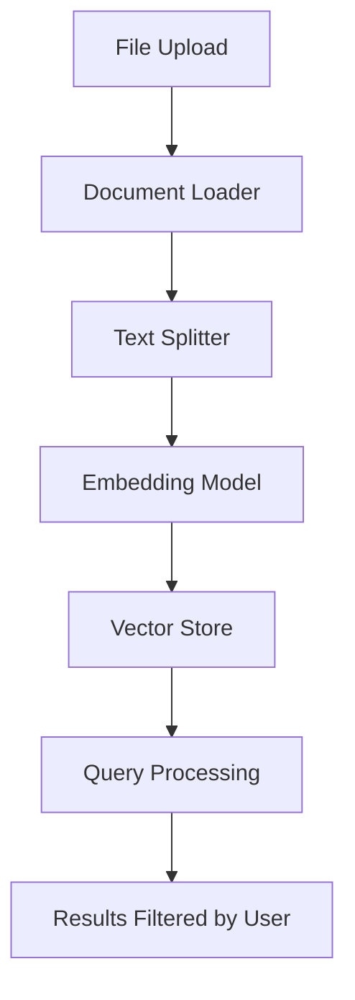

# RAG API Project Context Analysis

## Document Processing Pipeline

1. **File Loading**:
   - Uses LangChain document loaders for various file types (PDF, CSV, Word, etc.)
   - Handles different content types and extensions
   - Supports text extraction from PDFs (including images if configured)

2. **Chunking**:
   - Uses `RecursiveCharacterTextSplitter` from LangChain
   - Default chunk size: 1500 characters
   - Default chunk overlap: 100 characters
   - Configurable via environment variables (`CHUNK_SIZE`, `CHUNK_OVERLAP`)

3. **Text Processing**:
   - Cleans text (removes null bytes)
   - Maintains page numbers and document structure
   - Handles overlap between chunks

## Embedding Process

1. **Embedding Providers**:
   - Supports multiple providers (OpenAI, Azure, HuggingFace, Ollama, Bedrock)
   - Default: OpenAI's `text-embedding-3-small`
   - Configurable via `EMBEDDINGS_PROVIDER` and `EMBEDDINGS_MODEL` env vars

2. **Vector Storage**:
   - Supports PostgreSQL (PGVector) and MongoDB Atlas
   - Each document chunk stored with:
     - Page content
     - Metadata (file_id, user_id, digest, etc.)
     - Embedding vector
   - Configurable collection name

## User Management

1. **Document Ownership**:
   - Documents associated with users via `user_id` in metadata
   - "public" user_id used for shared documents
   - Authorization checks ensure users can only access their own documents

2. **Query Processing**:
   - Filters results based on user_id
   - Supports both single and multiple document queries
   - Maintains document context during retrieval

## Configuration

- **Chunking**: `CHUNK_SIZE`, `CHUNK_OVERLAP`
- **Embeddings**: `EMBEDDINGS_PROVIDER`, `EMBEDDINGS_MODEL`
- **Vector Store**: `VECTOR_DB_TYPE`, connection strings
- **File Handling**: `RAG_UPLOAD_DIR`, `PDF_EXTRACT_IMAGES`

## Architecture



## Install and run

Here's how to run the project locally with Python:

Set up virtual environment (recommended):

```
python -m venv venv
source venv/bin/activate  # Linux/Mac
```

`venv\Scripts\activate  # Windows`

# Install dependencies:

`pip install -r requirements.txt`

# Database setup:

Ensure PostgreSQL is running (default database)
Or configure MongoDB Atlas in .env if using that instead
Start the FastAPI server:

`uvicorn main:app --reload`

# Access the API:

Development server: http://localhost:8000

API docs: http://localhost:8000/docs

# Optional development tools:

`pip install -r test_requirements.txt`  # For testing

`pre-commit install`  # For code formatting

Note: The --reload flag enables auto-reload during development.